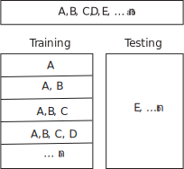
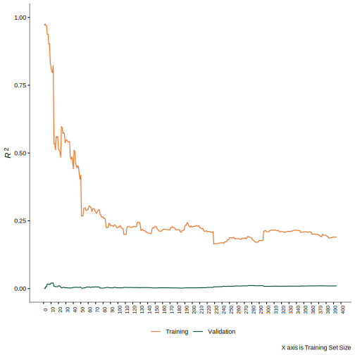
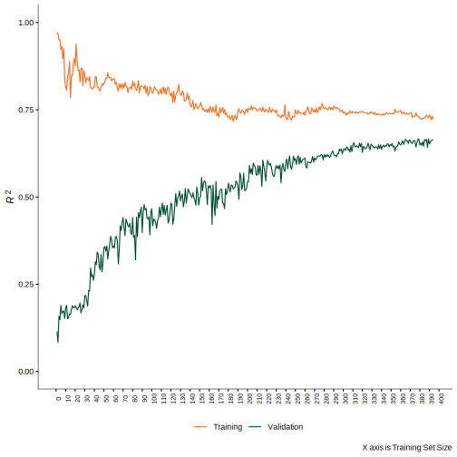

```{r, include = FALSE}
knitr::opts_chunk$set(
  collapse = TRUE,
  comment = "#>"
)
```

```{r setup}
# Install the package from github
# install.packages("devtools")
# devtools::install_github("https://github.com/focardozom/BreakNBuild")

library(BreakNBuild) 

```

# Machine Learning Model Evaluation using `BreakNBuild`

The `BreakNBuild` package provides tools for model evaluation through progressive data splitting and performance analysis. The `progressive_splits()` function enables users to assess model behavior across varying training set sizes, generating learning curves that reveal critical insights into model characteristics such as:

- Bias-variance trade-offs
- Learning rate patterns
- Optimal training set sizes
- Potential underfitting or overfitting issues

This vignette demonstrates the package's capabilities using a synthetic dataset with embedded non-linear relationships. We compare two modeling approaches:

1. **Linear Regression (LM)**: A parametric model that assumes linear relationships, used to illustrate how model bias can affect generalization performance
2. **Support Vector Machine (SVM)**: A flexible non-linear model capable of capturing non-linear patterns, providing contrast in handling non-linear relationships

Through these examples, we'll show how `BreakNBuild`'s diagnostic tools can inform model selection and debugging processes by visualizing performance metrics across different training set sizes.

## Simulating the Dataset

We'll create a synthetic dataset hiding non-linear relationships. We'll generate 500 observations with 5 predictor variables, and then construct a response variable that depends on both linear and quadratic terms of these predictors. This non-linear relationship will help us showcase how different models handle a non-linear patterns in the data. The final dataset will retain only the original predictors (without the quadratic terms) to simulate a realistic scenario where the true underlying non-linear relationship is "unknown" to the modeler.

```{r}
set.seed(2023) # Ensures reproducibility

n <- 500 # Number of observations
X <- matrix(rnorm(n * 5), ncol = 5) # Generating 5 predictors

# Generating non-linear terms
X_nonlinear <- cbind(X, X[, 1]^2, X[, 3]^2)
beta_nonlinear <- c(.3, -.2, .4, -.1, .2, .6, .8)
y_nonlinear <- X_nonlinear %*% beta_nonlinear + rnorm(n)

# Constructing the dataset and removing non-linear terms for model evaluation
df_nonlinear <- cbind(y_nonlinear, X_nonlinear) |>
  tibble::as_tibble() |>
  dplyr::select(-c(V7, V8))

# Assigning column names
colnames(df_nonlinear) <- c("Y", paste0("X", 1:5))

```

## Modeling Approach

Now, we'll specify the two modeling approaches we'll use to evaluate the dataset.

### Linear specification 

Specify a linear regression model using the parsnip package:

```{r}
library(parsnip)
lm_model <- linear_reg() |>
  set_mode("regression")
```

### Support Vector Machine

Specify a svm model using the parsnip package:

```{r}
svm_model <- svm_rbf() |>
  set_mode("regression")
```

### Recipe Definition

We'll create a recipe using the `recipes` package to define our model's preprocessing steps. The recipe specifies the relationship between our response variable `Y` and all available predictors. While this preprocessing step isn't strictly necessary for these simple models, it demonstrates `BreakNBuild`'s compatibility with the `tidymodels` workflow framework, allowing for more complex preprocessing scenarios in real-world applications.

```{r message=FALSE}
library(recipes)
recipe <- recipe(Y ~ ., data = df_nonlinear)
```

### Data Splitting

The `BreakNBuild` package's `progressive_splits()` function creates multiple training/testing splits of your data, where:

1. The testing (assessment) set remains constant at 20% of your total data.  
2. The training set starts small and progressively grows larger.  
3. The initial training set size (`start_size = 7`).  

```{r}
progressive_sets <- progressive_splits(df_nonlinear, assessment_size = 0.2, start_size = 7)
```

For example, with our dataset of 500 observations:
- The assessment (testing) set is always 100 observations (20% of 500)
- The training set starts with 7 observations
- Each subsequent split increases the training set size (7, 8, 9, ...)
- The final split uses all remaining 400 observations for training

The figure below illustrates how the function organizes these progressive data splits:



## Workflow Assembly

Let's create a workflow object as used in the `tidymodels` framework.

### Workflow Assembly - Linear Model

We'll create a workflow object that combines our linear regression model with the preprocessing recipe. In the `tidymodels` framework, workflows provide a convenient way to bundle model specifications with preprocessing steps:

```{r}
library(workflows)
lm_wf <- workflow() |>
  add_model(lm_model) |>
  add_recipe(recipe)
```

### Model Estimation

The LM model cannot capture the non-linear relationship in the data, and therefore it will likely perform poorly.

To get the training error we use `get_training_error`. This function uses `fit_resamples()` from the `rsample` package to fit the model on the training set and then computes the error using the `yardstick` package. 

To get the validation error we use `get_validation_error`. This function uses `fit_resamples()` and then uses the collect_metrics() function to get the error from the validation sets. 

#### Compute the training error 

```{r eval=FALSE}
training_error <- get_training_error(lm_wf, progressive_sets, "rsq")
```

#### Compute the validation error 

```{r eval=FALSE}
validation_error <- get_validation_error(lm_wf, progressive_sets, "rsq")
```

#### Visualization of Findings

Once you have this two objects, you can use the `get_learning_curve()` function to plot the training and validation errors:

```{r eval=FALSE}
get_learning_curve(validation_error, training_error)
```



The linear model's performance confirms our expectations - it struggles to capture the non-linear relationship in the data. The validation error remains consistently poor, showing no improvement even with more training data. Furthermore, after reaching 50 observations in the training set, the model's learning plateaus and begins to deteriorate, indicating that additional data does not help the model learn the underlying non-linear patterns.

### Workflow Assembly - Non-linear Model

For our SVM model, we'll create a similar workflow that combines the SVM specification with the same preprocessing recipe. This ensures consistent data preparation across both models while changing only the modeling approach:

```{r}
svm_wf <- workflow() |>
  add_model(svm_model) |>
  add_recipe(recipe)
```

### Model Estimation

As we did before, we can compute the training and validation errors for the SVM model.

#### Compute the training error 

```{r eval=FALSE}
training_error <- get_training_error(svm_wf, progressive_sets, "rsq")
```

#### Compute the validation error 

```{r eval=FALSE}
validation_error <- get_validation_error(svm_wf, progressive_sets, "rsq")
```

#### Visualization of Findings

```{r eval=FALSE}
get_learning_curve(validation_error, training_error)
```



So, much better! The SVM model is able to capture the non-linear relationship in the data, and therefore it performs better than the linear model. The validation error is lower, and the model continues to learn even when the training set size is increased. It looks like more data will be beneficial for the SVM model.


## Conclusion

The `progressive_splits()` function in `BreakNBuild` is an effective tool for evaluating model performance across increasing training set sizes. It can help diagnose issues such as suboptimal model performance due to biased model selection. The `get_learning_curve()` function provides an intuitive visualization of the relationship between training set size and model performance, helping users identify optimal training set sizes for their specific use cases.


